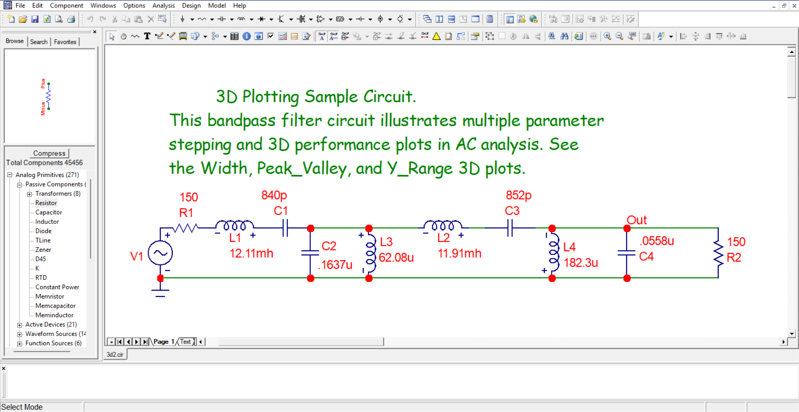

# Micro-Cap 12 Archive

This repository serves as an unofficial archive and starter guide for **Micro-Cap 12**, the powerful SPICE-based circuit simulator. 

## History & Status
Micro-Cap was a professional-grade circuit simulator developed by Spectrum Software. In 2019, Spectrum Software closed down, and the developers generously released Micro-Cap 12 as **free to download** (Freeware) for the engineering community. 

Since the original website is no longer active, this repository aims to preserve the software and make it easily accessible for students, hobbyists, and engineers.

## Download Options
You can download the installer using either of the methods below:

### Option 1: Direct Download (Fastest)
Download the zip file directly from this repository.
📥 **[Download Micro-Cap 12 (ZIP)](https://github.com/NeelPatra/Micro-Cap-12-Archive/releases/download/v12.2.0/Micro-Cap-12.2.0.zip)** *(Size: ~60 MB | OS: Windows)*

### Option 2: Internet Archive (Original Source)
If you prefer to download from the archive preservation project directly.
🏛️ **[View on Internet Archive](https://archive.org/details/mc12cd_202110)**

## Why use Micro-Cap?
* **Completely Free:** No license required, fully unlocked.
* **Visual Interface:** Intuitive schematic capture.
* **Powerful:** Handles analog, digital, and mixed-signal simulations.
* **Lightweight:** Runs well on older hardware.

## Installation
1.  Download the `.zip` file.
2.  Extract the contents to a folder.
3.  Run `setup.exe` (or the equivalent installer file inside).
4.  Follow the on-screen prompts.

## License & Disclaimer
**Software License:** The Micro-Cap software is the intellectual property of Spectrum Software (defunct). It is hosted here strictly for preservation and educational purposes under its status as Freeware/Abandonware. This repository claims no ownership of the executable binaries.

**Repository Content:** The documentation and example circuits provided in this repository (if any) are open source.
